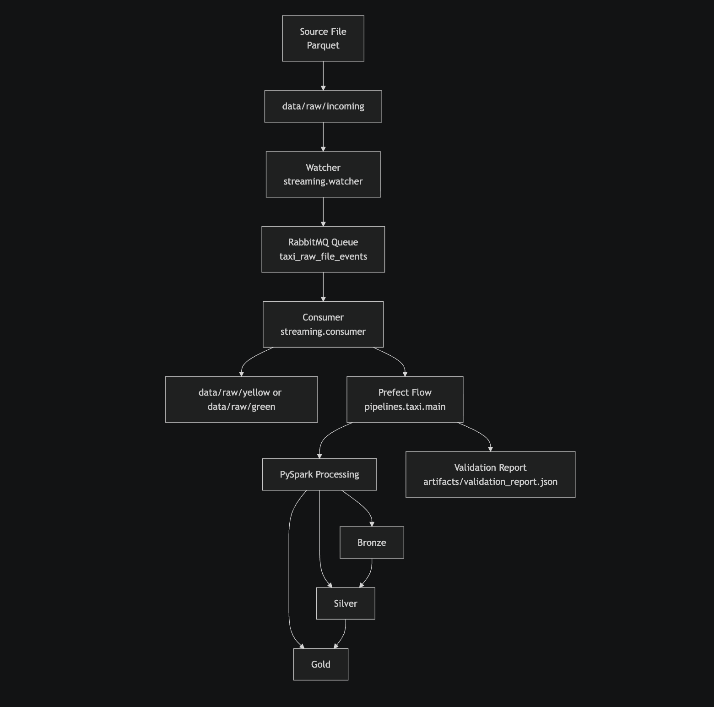

# NYC TLC Medallion Pipeline (Prefect + PySpark + RabbitMQ Micro-Batch)

## Cel projektu

Repozytorium realizuje pipeline danych NYC TLC taxi w architekturze Medallion:

- bronze: surowe dane po inicjalnym zaladowaniu,
- silver: dane ustandaryzowane i oczyszczone,
- gold: zagregowane tabele analityczne.

Glowny pipeline batchowy pozostaje bez zmian i nadal dziala przez Prefect + PySpark.

Projekt zostal rozszerzony o prosta faze event-driven micro-batch:

source file -> watcher -> RabbitMQ -> consumer -> istniejacy pipeline Prefect/PySpark -> bronze/silver/gold -> validation

To nie jest pelny, ciagly streaming real-time. To lokalny, prosty trigger kolejkowy nad istniejacym pipeline batchowym.

## Dlaczego RabbitMQ

- Jest lekki i prosty do lokalnego demo.
- Daje jawna kolejke miedzy wykryciem pliku a uruchomieniem pipeline.
- Pozwala spelnic wymaganie queue-based ingestion bez dokladania drugiego orkiestratora.

## Sprawdzone wersje

- Prefect: 3.6.26
- PySpark: 3.5.2
- PyArrow: 20.0.0
- pika: 1.3.2

## Architektura



## Struktura repo

```text
.
├── pipelines/
│   └── taxi/
│       ├── config.py
│       ├── ingestion.py
│       ├── bronze.py
│       ├── silver.py
│       ├── gold.py
│       ├── validation.py
│       ├── spark_session.py
│       └── main.py
├── streaming/
│   ├── __init__.py
│   ├── config.py
│   ├── message_schema.py
│   ├── publisher.py
│   ├── watcher.py
│   └── consumer.py
├── docs/
│   ├── architecture_diagram.md
│   ├── data_quality_risks.md
│   ├── flow-diagram.png
│   └── problem_statement.md
├── artifacts/                    # validation + registry watcher (runtime)
├── data/
│   ├── raw/
│   │   ├── incoming/             # runtime, monitorowany przez watcher
│   │   ├── yellow/
│   │   ├── green/
│   │   └── taxi_zone_lookup.csv
│   ├── bronze/
│   ├── silver/
│   └── gold/
├── Makefile
└── requirements.txt
```

## Entrypoint batchowy (bez zmian)

Główny entrypoint uruchamiający pełny przepływ:

```bash
python -m pipelines.taxi.main
```

## Instalacja

```bash
python -m venv .venv
source .venv/bin/activate
pip install -r requirements.txt
```

## Uruchomienie pipeline batch

### 1) Mała próbka (local smoke)

```bash
python -m pipelines.taxi.main --sample --years 2025 --months 1 --services yellow green
```

### 2) Pełniejszy zakres miesięcy

```bash
python -m pipelines.taxi.main --years 2024 2025 --months 1 2 3 4 5 6 7 8 9 10 11 12 --services yellow green
```

### 3) Użycie wcześniej pobranych danych (bez download)

```bash
python -m pipelines.taxi.main --skip-download --years 2025 --months 1 2 3 --services yellow green
```

## Streaming micro-batch (watcher + RabbitMQ + consumer)

### Co robi warstwa streaming

1. Watcher (polling) monitoruje katalog data/raw/incoming.
2. Po wykryciu nowego pliku parquet publikuje event do RabbitMQ.
3. Consumer odbiera event.
4. Consumer przenosi plik z incoming do data/raw/{service}/.
5. Consumer uruchamia istniejacy pipeline Prefect/PySpark dla scope:
   years=[event.year], months=[event.month], services=[event.service_type], skip_download=True.
6. Pipeline zapisuje bronze/silver/gold oraz validation report tak jak dotychczas.

### Prosty format eventu

```json
{
  "event_type": "new_raw_file",
  "service_type": "yellow",
  "year": 2025,
  "month": 2,
  "file_path": "data/raw/incoming/yellow_tripdata_2025-02.parquet"
}
```

### Idempotency watchera

Watcher zapisuje bardzo prosty registry JSON:

- artifacts/watcher_published_registry.json

Plik zawiera liste sciezek plikow, ktore juz zostaly opublikowane do kolejki.
Brak hashy i brak rozbudowanego state management.

## Lokalny start RabbitMQ

Najprosciej przez Docker:

```bash
docker run -d --name rabbitmq-demo -p 5672:5672 rabbitmq:3-management
```

## Lokalne demo event-driven micro-batch

W osobnych terminalach:

1. Uruchom consumer:

```bash
make run-consumer
```

2. Uruchom watcher:

```bash
make run-watcher
```

3. Wrzuc nowy plik do incoming, np.:

```bash
cp data/raw/yellow/yellow_tripdata_2025-01.parquet data/raw/incoming/yellow_tripdata_2025-01.parquet
```

4. Obserwuj logi:

- watcher publikuje event do RabbitMQ,
- consumer odbiera event,
- consumer przenosi plik do data/raw/yellow/,
- uruchamia sie pipeline dla scope 2025-01 yellow,
- aktualizowane sa warstwy bronze/silver/gold i artifacts/validation_report.json.

## Makefile

```bash
make install
make run-sample
make run-full
make ci-smoke
make run-watcher
make run-consumer
```

## Co robi flow Prefect

Flow wykonuje kolejno taski:

1. prepare directories
2. download source files (lub skip przy streaming consumer)
3. build bronze layer
4. build silver layer
5. build gold layer
6. run data quality validation

## Walidacja jakosci

Po zbudowaniu gold uruchamiany jest moduł walidacji, który:

- liczy rekordy bronze/silver/gold,
- sprawdza reguły quality w silver,
- liczy liczbę rekordów gold z nierozpoznaną strefą,
- zapisuje raport do `artifacts/validation_report.json`,
- kończy flow błędem, jeśli krytyczne checki nie przejdą.

## Data Product (consumer quick view)

Glowny data product w tym repo to `monthly_zone_metrics` (warstwa `gold`).

- primary dataset: `data/gold/taxi/monthly_zone_metrics/`
- supporting dataset: `data/gold/taxi/payment_type_metrics/`
- glowny kontrakt produktu: `docs/data_product_contract.yaml`

### Szybki start dla konsumenta

1. Uruchom sample pipeline:

```bash
python -m pipelines.taxi.main --sample --years 2025 --months 1 --services yellow green
```

2. Odczytaj produkt:

```bash
make run-user-test
```

Lub bez Makefile:

```bash
python scripts/user_data_product_test.py
```

3. Sprawdz jakość danych produktu:

```bash
cat artifacts/data_product_quality_metrics.json
```

### Quality metrics (automatycznie liczone po pipeline run)

- zone_mapping_completeness
- silver_rule_compliance
- gold_row_count
- data_freshness_hours

Wszystkie metryki maja definicje, current value, threshold i cadence w:

- `artifacts/data_product_quality_metrics.json` (aktualne wartosci, format maszynowy)
- `artifacts/data_product_quality_report.md` (raport do czytania)
- `artifacts/data_product_quality_summary.png` (wykres wizualny)
- `docs/data_product_contract.yaml` (kontrakt + opis konsumencki)
